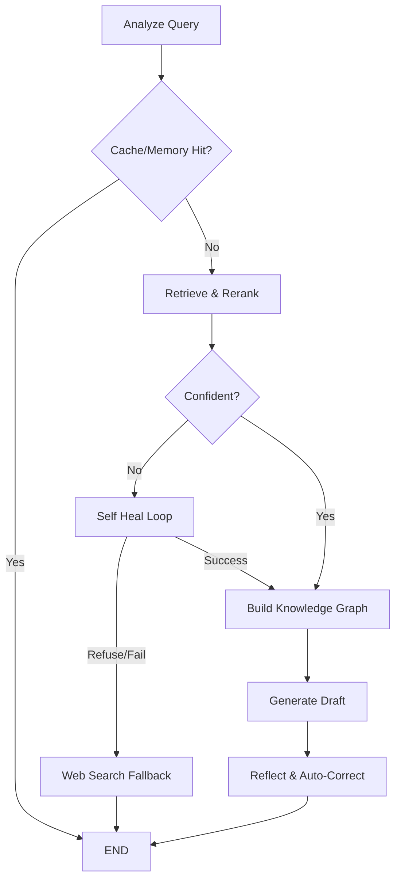

# 🧠 Synapse AI: Self-Healing Agentic RAG

Synapse AI is an enterprise-grade, **Self-Healing Retrieval-Augmented Generation (RAG)** application. Powered by **LangGraph**, **FastAPI**, and a **React (Vite)** frontend, it represents the bleeding edge of local AI architectures. 

Instead of a traditional linear RAG pipeline, Synapse uses a dynamic **State Machine**. If it retrieves poor context, it doesn't just hallucinate an answer—it actively "heals" itself by altering its search strategy, reranking documents, or autonomously pivoting to scrape the live web.

---

## ✨ Cutting-Edge Features

- **🕸️ LangGraph Orchestration**: A recursive state machine that intelligently routes data through nodes (`Analyze` → `Retrieve` → `Self Heal` → `Generate` → `Reflect`).
- **⚡ Asynchronous Token Streaming**: Real-time "typing" experience powered by Server-Sent Events (SSE).
- **🔎 Agentic Web Search Fallback**: If local PDFs lack the answer, the agent autonomously searches the live internet (via DuckDuckGo) and cites live URLs.
- **🧬 Semantic Chunking**: Ingestion pipeline reads sentence by sentence, splitting documents precisely on semantic topic shifts using embedding distances.
- **💾 Semantic Caching & Memory**: Bypasses expensive LLM inference for repeated questions and maintains persistent entity/conversation memory across server restarts.
- **📊 On-The-Fly GraphRAG**: Rapidly extracts Knowledge Graph triplets (`Entity` → `Relationship` → `Entity`) in real-time to grant the LLM superhuman multi-hop reasoning capabilities.
- **🖱️ Dynamic Drag-and-Drop Ingestion**: Upload PDFs directly from the UI to hot-swap the vector database with zero server downtime.
- **👁️ Visual Node Inspector**: A beautiful React sidebar that lights up in real-time to show you exactly which node the agent is currently "thinking" in.

---

## 🛠️ Tech Stack

- **Backend / Orchestration**: FastAPI, LangGraph, LangChain, Pydantic
- **AI / Embeddings**: Ollama (`llama3.2`, `mxbai-embed-large`)
- **Vector Database**: ChromaDB (SQLite local persistence)
- **Frontend**: React.js (Vite), CSS3 Glassmorphism

---

## 🚀 Getting Started

### 1. Prerequisites
Ensure you have the following installed:
- Python 3.10+
- Node.js 18+
- [Ollama](https://ollama.ai/) installed and running locally.

Pull the required local models:
```bash
ollama run llama3.2
ollama pull mxbai-embed-large
```

### 2. Backend Setup
Clone the repository and set up your Python virtual environment:
```bash
git clone https://github.com/YOUR_USERNAME/synapse-ai-rag.git
cd synapse-ai-rag

# Create and activate virtual environment
python -m venv venv
# Windows:
.\venv\Scripts\activate
# Mac/Linux:
source venv/bin/activate

# Install dependencies
pip install -r requirements.txt
```

Start the FastAPI server:
```bash
uvicorn src.app:app --reload
```

### 3. Frontend Setup
Open a new terminal window:
```bash
cd frontend
npm install
npm run dev
```

The UI will be available at `http://localhost:5173`. 

---

## 🎯 Usage

1. **Ingest a Document**: Click the paperclip icon in the chat input bar to upload a PDF. Watch the progress toast as the backend mathematically chunks the semantics.
2. **Ask Questions**: Ask questions based on your document. Watch the LangGraph Inspector sidebar to see the agent flow from `Retrieve` to `Generate`.
3. **Trigger Web Fallback**: Ask a question outside the scope of your document (e.g., "What is the latest AI news?") and watch the state machine gracefully fall back to `web_search_fallback`!

---

## 🏗️ Architecture



---

## 📜 License
MIT License - Free to use, modify, and distribute.
